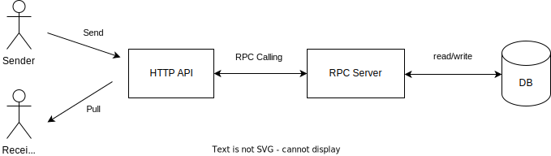

# TikTok Tech Immersion Assignment 2023 <!-- omit in toc -->


[Assignment instruction](https://bytedance.sg.feishu.cn/docx/P9kQdDkh5oqG37xVm5slN1Mrgle): Design and implement a backend Instant Messaging system

Features:
- Send messages
- Receive messages


Reference: https://bytedance.sg.feishu.cn/docx/P9kQdDkh5oqG37xVm5slN1Mrgle

# Table of Contents <!-- omit in toc -->
- [Tools used](#tools-used)
- [Scalability](#scalability)
- [JMeter](#jmeter)
- [Kitex](#kitex)
- [Hertx](#hertx)
- [Setup](#setup)
  - [Option 1: Using docker compose to run the project](#option-1-using-docker-compose-to-run-the-project)
  - [Option 2: Using Kubernetes](#option-2-using-kubernetes)
    - [1. Build Docker Image](#1-build-docker-image)
    - [2. Push to Docker Hub](#2-push-to-docker-hub)
    - [3. Run using Kubernetes](#3-run-using-kubernetes)
    - [Change the number of pods](#change-the-number-of-pods)
- [API Documentations](#api-documentations)
  - [Ping](#ping)
  - [Send Message](#send-message)
  - [Pull/Retrieve messages](#pullretrieve-messages)
- [Reference](#reference)

# Tools used

- [Golang](https://go.dev/) programming language
- [Kitex](https://www.cloudwego.io/docs/kitex/getting-started/)
- [Hertx](https://www.cloudwego.io/docs/hertz/getting-started/): Protobuf protocol
- [Redis](https://redis.io/): database to store messages
- [Docker Desktop](https://www.docker.com/products/docker-desktop/) and Kubernetes
- Github Actions: to automate the testing
- [Postman](https://www.postman.com/downloads/): To test the api

# Scalability

- Used Kubernetes
- The config YAML files are in `k8` folder

# JMeter

- JMeter, an open-source load testing tool
- To test the scalability and performance of the applications
- To use `HTTP Request.jmx` file, install JMeter. For MacOS, `brew install jmeter`

# Kitex
- `kitex_gen` folder includes codes generated from `idl_rpc.thrift`, which generates RPC client code to be used in both HTTP Server and RPC Server
- Remember to regenerate the codes, if you modify the definitions to `idl_rpc.thrift` file
- Install thrift compiler: `go install github.com/cloudwego/thriftgo`
- Install Kitex: `go install github.com/cloudwego/kitex/tool/cmd/kitex@latest`
- Generate the code for both http-server and rpc-server
```bash
cd ./rpc-server
kitex -module "github.com/ernst12/Backend_Server-TikTok_Tech_Immersion-Assignment/rpc-server" -service imservice ../idl_rpc.thrift
cp -r ./kitex_gen ../http-server # copy kitex_gen to http-server
```

# Hertx

- Remember to update `idl_http.proto` file and regenerate the code, if you modify the API definitions
- To regenerate the code:
1. Install Protobuf: `brew install protobuf`
2. Install protoc-gen-go plugin to generate idl code: `go install github.com/golang/protobuf/protoc-gen-go@latest`
3. Generate new API definitions: `protoc --go_out=./http-server/proto_gen/api --go_opt=paths=source_relative ./idl_http.proto`

# Setup

- You can either run the project using docker compose or kubernetes
- You may install [Docker Desktop](https://www.docker.com/products/docker-desktop/) and enable Kubernetes in the Docker Desktop
- Clone this project to your computer:
```bash
git clone https://github.com/ernst12/Backend_Server-TikTok_Tech_Immersion-Assignment.git
cd Backend_Server-TikTok_Tech_Immersion-Assignment
```

## Option 1: Using docker compose to run the project

run the command `docker compose up --build` in the terminal

## Option 2: Using Kubernetes

### 1. Build Docker Image

- Build the docker image by running the command `docker build -t {image tag} {path to dockerfile}` in the terminal
- For example, run the commands `docker build -t ernst1/http-server ./http-server` and `docker build -t ernst1/rpc-server ./rpc-server` in the terminal
- Note: If you change the image tag, remember to update the files in `k8` folder so that it gets the correct docker image

### 2. Push to Docker Hub

- Login to Docker Hub, if you haven't logged in yet
- Run the command to push your docker image to docker hub: `docker push {image tag}`
  - Eg. run the commands `docker push ernst1/rpc-server` and `docker push ernst1/http-server` in the terminal
- Note: When pushing to Docker Hub, the image tag format should be `{your docker username}/{image name}`

### 3. Run using Kubernetes

run the command `kubectl apply -f ./k8` in the terminal

If you want to delete the services and deployments created (after running the above command), you can run the following commands:
```bash
kubectl delete deployment http-server-depl redis-depl rpc-server-depl etcd-depl

kubectl delete services http-server redis rpc-server etcd
```

### Change the number of pods

- You may change the number of pods running by changing the file in `k8` folder.
- For example, you may change `replicas: 2` to `replicas: 3` (to run 3 pods for that service) in `k8/http-server-depl.yaml` file

# API Documentations

- Example of a base url: `http://localhost:8080`, if you are using docker compose

## Ping

Check whether server is running

GET `/ping`

Expected response:

- Status: 200 OK.
- Output:

```json
{
  "message": "pong"
}
```

## Send Message

POST `/api/send`

Body parameters:
| Param  | Type   | Description                                 |
| ------ | ------ | ------------------------------------------- |
| chat   | string | Chat ID. <br/>Format: `<member1>:<member2>` |
| text   | string | Text message to send                        |
| sender | string | Sender name                                 |

Sample Request body:

```json
{
  "chat": "jack:marcus",
  "text": "hello",
  "sender": "jack"
}
```

Expected response: Empty

## Pull/Retrieve messages

GET `/api/pull`

**Note**: It's not common to send a data body in a GET request, but the demo given to us is in this way and the instruction states that we shouldn't modify the http-server code

Body parameters: (send in the body)
| Param   | Type    | Description                                                     |
| ------- | ------- | --------------------------------------------------------------- |
| chat    | string  | Chat ID. <br/>Format: `<member1>:<member2>`                     |
| cursor  | int     | Starting position of the messages (inclusively). Default: 0     |
| limit   | int     | Maximum number of messages returned per request. Default: 10    |
| reverse | boolean | If false, the results will be sorted in ascending order by time |

Sample Request body:

```json
{
  "chat": "jack:marcus",
  "cursor": 0,
  "limit": 10,
  "reverse": false
}
```

Response Body Parameter:
Body parameters: (send in the body)
| Param       | Type    | Description                                                    |
| ----------- | ------- | -------------------------------------------------------------- |
| messages    | array   | List of messages                                               |
| has_more    | boolean | If true, can use next_cursor to pull the next page of messages |
| next_cursor | int     | Starting position of next page, inclusively                    |

Sample response data:

```json
{
  "messages": [
    {
      "chat": "jack:marcus",
      "text": "good morning",
      "sender": "jack",
      "send_time": 1684770951
    },
    {
      "chat": "jack:marcus",
      "text": "hello",
      "sender": "marcus",
      "send_time": 1684770116
    }
  ],
  "has_more": true,
  "next_cursor": 2
}
```

# Reference
- https://bytedance.sg.feishu.cn/docx/P9kQdDkh5oqG37xVm5slN1Mrgle
- https://o386706e92.larksuite.com/docx/QE9qdhCmsoiieAx6gWEuRxvWsRc
